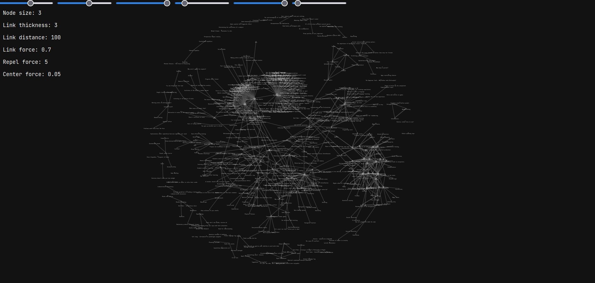
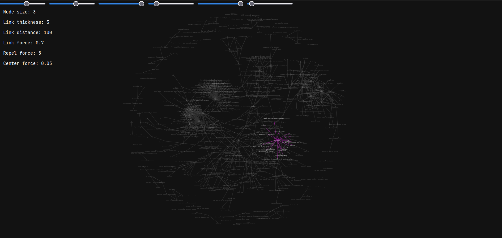

# VIZK

`vizk`, short for *VIsualise ZettelKasten*, is a component of `settle` written
in HTML and Javascript through which you may interact with your Zettelkasten in
your web browser of choice.

Under the hood, it uses [d3.js](https://d3js.org/) for the simulation and the
rendering and, aside from having to import this single depepdency, the
visualiser is ran completely offline. If you don't have an internet connection
when you first run `vizk`, then nothing will show up because `d3.js` couldn't
have been imported.

You may highlight nodes and their connection by hovering with your mouse on
them, you may drag nodes, and you may play around with a few parameters (namely,
node size, link thickness, link distance, link attraction force, repulsion
force, and the force of attraction to the center) through sliders.

## Usage

You may turn query results into a visualisation by using the `--graph "vizk"`
option:

```
$ settle query --graph "vizk"
```

That prints the visualiser's code. But in order to do something useful, you'd
ideally save it as a file and open it with your preferred browser (e.g.
Firefox):

```
$ settle query --graph "vizk" >vizk.html
$ firefox vizk.html
```

Note that **the graph data is hardcoded** in the HTML file, so to visualise any
change to your Zettelkasten you must re-run the command and re-open the file in
your browser.

## Screenshots

The following screenshots were took using Firefox 117.0, using a Zettelkasten of
a bit more than 500 notes (including "ghosts", which are files that have been
referenced but don't yet exist).



And here's an example highlighting a node and its links:


